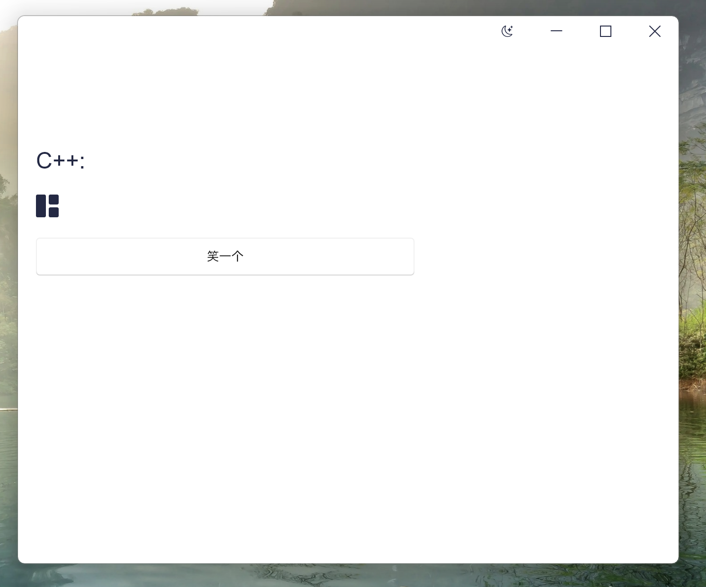

# Slint 无边框窗口 Demo（Windows）

基于 **Slint + C++** 的 Windows 桌面 Demo，演示如何在 **Slint UI 框架中实现原生 Win32 风格的无边框窗口**，并保留系统级 **DWM 阴影效果**。

---
## UI

## 功能特性

- 无系统标题栏（Frameless Window）
- 保留 Windows 原生 DWM 阴影
- Slint UI 渲染（非 Win32 GDI / DirectUI）
- C++ 侧精确控制窗口生命周期
- 支持后续扩展：拖拽、Resize、自绘标题栏

---

## 技术栈

- **UI 框架**：Slint (C++)
- **语言**：C++20
- **平台**：Windows 10 / 11
- **窗口系统**：Win32 + DWM
- **构建系统**：CMake

---

## 项目结构

graph TD
    A[Application] --> B[CMakeLists.txt]
    A --> C[src]
    C --> C1[main.cpp]
    C --> C2[utils]
    C2 --> C2a[EnableWindowShadow.h]
    C2 --> C2b[EnableWindowShadow.cpp]
    A --> D[ui]
    D --> D1[main.slint]
    D --> D2[theme.slint]
    D --> D3[components]
    D3 --> D3a[icons.slint]
    D3 --> D3b[title.slint]

